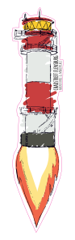

# ctfl-rakete-pcb

Converting this sticker desing into a PCB that lights up its flame and lighthouse top from the bottom side using some LEDs and a coin cell battery.

## Implementing the colors

Produce the PCBs with **red solder mask** and **white Silkscreen**.

| color | objects | pcb layers present | notes |
| --- | --- | --- | --- |
| white | background | F.Silkscreen? |  |
| white | w_flame | F.Silkscreen | only white silk screen could hopefully be a little translucent |
| yellow | y_flame, y_light | none | blank FR4 should give a nice translucent yellow |
| red | r_flame | F.Mask | only red solder mask should give a nice translucent red |
| red | r_tower, r_top, r_roof | F.Mask, f.Cu | with the copper underneath, the red solder mask should appear darker than at the flame |
| light grey | w_base, w_tower | F.Cu, F.Silkscreen |  |
| dark grey | g_base | F.Cu, ??? | idk, how to differentiate from black outlines? |
| black | b_contours, b_name | F.Cu, F.Mask | only copper coated with tin should give a nice contouring contrast |

