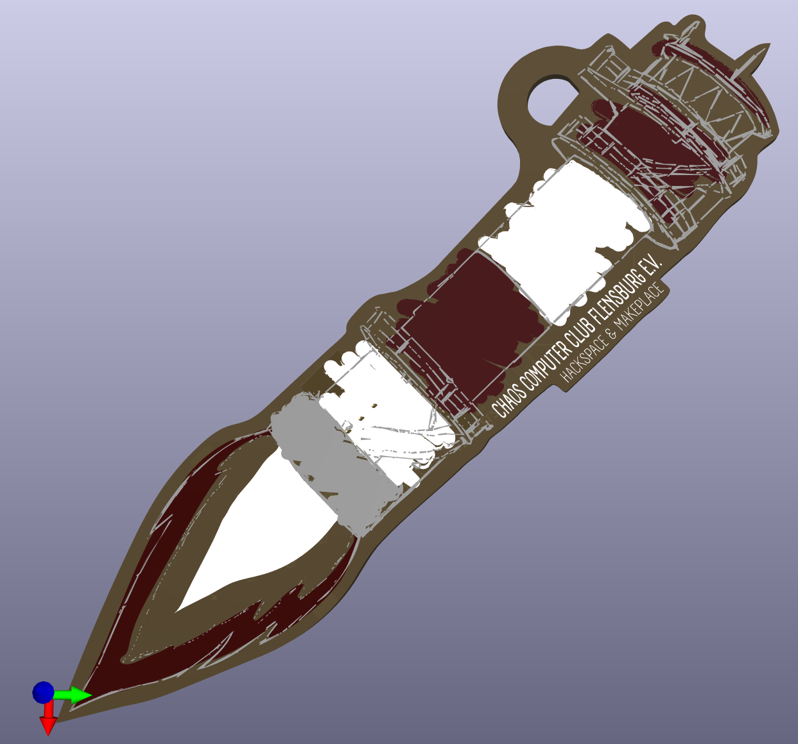

# ctfl-rakete-pcb

Converting this sticker desing into a PCB that lights up its flame and lighthouse top from the bottom side using some LEDs and a coin cell battery.

## Implementing the colors

Produce the PCBs with **red solder mask** and **white Silkscreen**.

| color | objects | pcb layers present | notes |
| --- | --- | --- | --- |
| white | background | F.Silkscreen |  |
| white | w_flame | F.Silkscreen | only white silk screen could hopefully be a little translucent |
| yellow | y_flame, y_light | none | blank FR4 should give a nice translucent yellow |
| red | r_flame | F.Mask | only red solder mask should give a nice translucent red |
| red | r_tower, r_top, r_roof | F.Mask, f.Cu | with the copper underneath, the red solder mask should appear darker than at the flame |
| light grey | w_base, w_tower | F.Cu, F.Silkscreen |  |
| dark grey | g_base | F.Cu, ??? | idk, how to differentiate from black outlines? |
| black | b_contours, b_name | F.Cu, F.Mask | only copper coated with tin should give a nice contouring contrast |

## Part sourcing

| reference | reichelt.de | mouser.de |
| --- | --- | --- |
| BT1 | [KZH 20SMD](https://www.reichelt.de/knopfzellenclip-fuer-20-mm-smd-kzh-20smd-p56574.html) | [BAT-HLD-003-SMT](https://www.mouser.de/ProductDetail/TE-Connectivity-Linx-Technologies/BAT-HLD-003-SMT) |
| SW1 | [SS SMD402](https://www.reichelt.de/schiebeschalter-1x-um-liegend-smd-ss-smd402-p112181.html) | [MSS-102545-14A-V-SMT](https://www.mouser.de/ProductDetail/CUI-Devices/MSS-102545-14A-V-SMT) |
| U1  | [ATTINY212](https://www.reichelt.de/8-bit-attiny-avr-risc-mikrocontroller-2-kb-20-mhz-soic-8-attiny212-ssn-p335520.html) | [ATTINY212-SSN](https://www.mouser.de/ProductDetail/Microchip-Technology/ATTINY212-SSN) |
| SMD LEDs | - | [859-LTW-220DS5](https://www.mouser.de/ProductDetail/Lite-On/LTW-220DS5) |
| 5mm LEDs | [EVERLIGHT 334-15/X1C5-6QSA/EU](https://www.reichelt.de/led-5-mm-bedrahtet-warmweiss-7150-mcd-50--led-el-5-7150ww-p164207.html) | [941-C512AWNSCZ0B0152](https://www.mouser.de/ProductDetail/Cree-LED/C512A-WNS-CZ0B0152) |

## Design ideas

- combined footprint for 0603-0805 LEDs and 5 mm LEDs that have their legs folded up on one side
- 5 LED channels from ATtiny85
  - 3 LEDs on lighthouse top for fast sweeping animation
  - 2 groups of LEDs for the flame
  - connection points to Vbat next to the MCU pads under the MCU package to substitute the MCU with solder links for static light
