# Allgemeine Tips

## Ein Anschluss nach dem Anderen

Es bietet sich an, bei jedem Bauteil folgendermaßen vorzugehen:
- Erst ein einzelnes Lötpad für dieses Bautie vor-verzinnen
  - Dafür die Spitze des Lötkolbens mit etwas Druck so an die zu verzinnende Fläche legen, dass noch genug Platz ist, um das Lot direkt zum heißen Lötpad zu führen
- Das Bauteil (bei Bedarf mit einer Pinzette) korrekt positionieren, sodass der eine Anschluss in dem frisch aufgebrachten Lot sitzt
- Den Lötkolben wegziehen und das Bauteil noch einen Augenblick fixieren, bis das Lot erkalet ist.

So kann jetzt noch, falls erforderlich, die Position des Bauteils an dieser einen Lötstelle korrigiert werden.

Bist du mit dem Sitz des Bauteils auf dem zugehörigen Footbrint zufrieden, verlötest du den/die übrigen Anschluss(-üsse) des Bauteils.

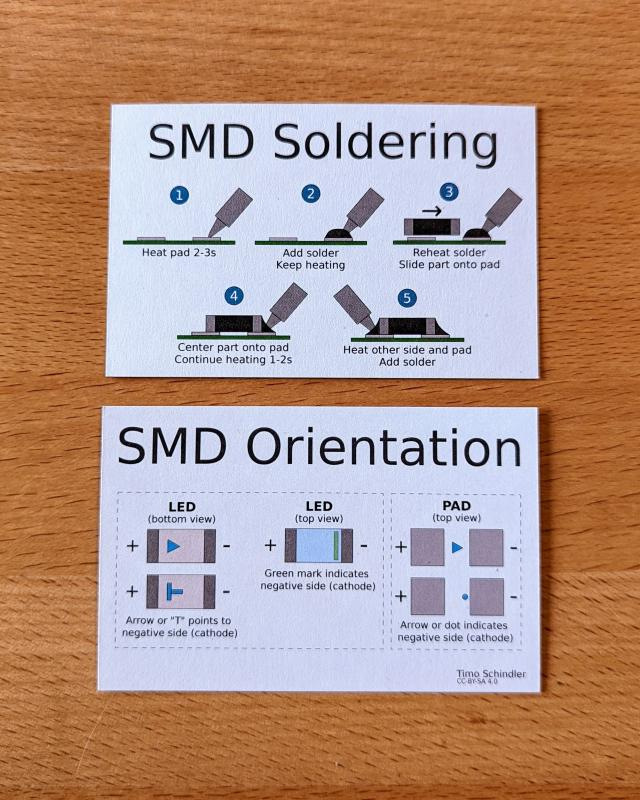

## Von Klein nach Groß und/oder von Innen nach Außen

Arbeite von innen nach außen und von kleinen Bauteilen zu großen. Es mag zwar verlockend sein, mit den großen, einfach zu lötenden Teilen anzufangen, aber üblicherweise sind sie dir dann später im Weg.

# Schwierigkeitsgrad 1: Mit Beinchen

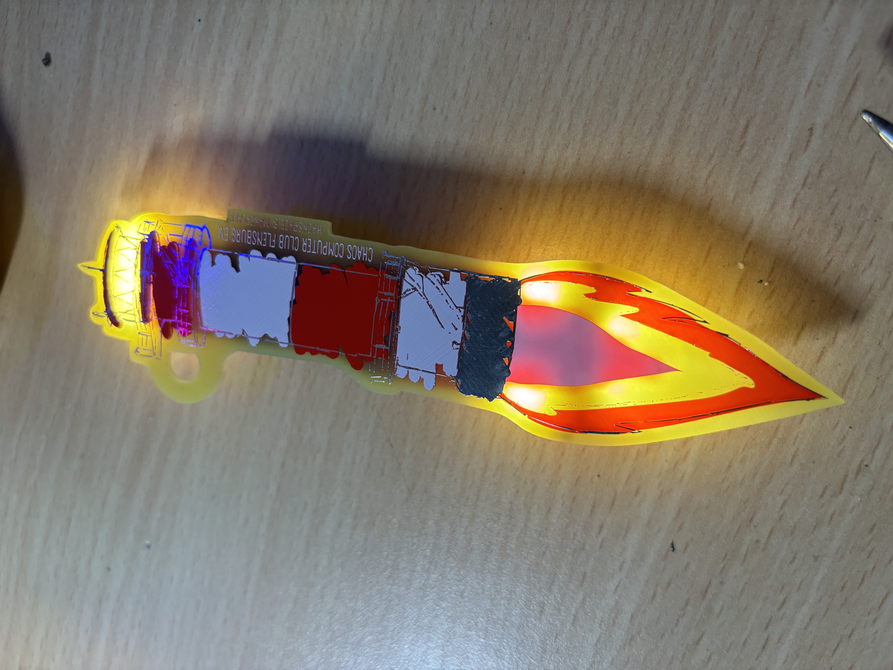

## Benötigte Bauteile

In empfohlener Bestückreihenfolge sortiert:

| Nummer | Anzahl |Name |
| --- | --- | --- |
| 1 | 1 | Platine |
| 2 | 1 | Schalter |
| 3 | 1 | Batteriehalter |
| 4 | 7 | weiße 5mm LED (ca. 3V)  |
| 5 | 1 | CR2032 Knopfzellenbatterie |

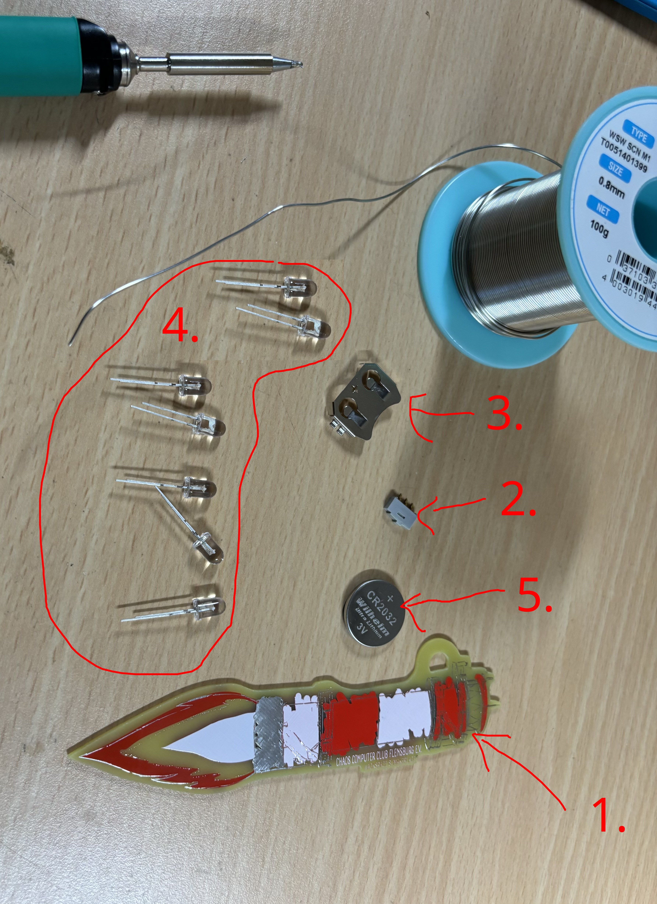

## Montage

Solange die Platine noch so schön leer ist, können die 5 Lötbrücken geschlossen werden, die die LEDs dauerhaft leuchten lassen, solange der Schalter an ist. Sie sind markiert mit der Beschriftung "LEDs on".

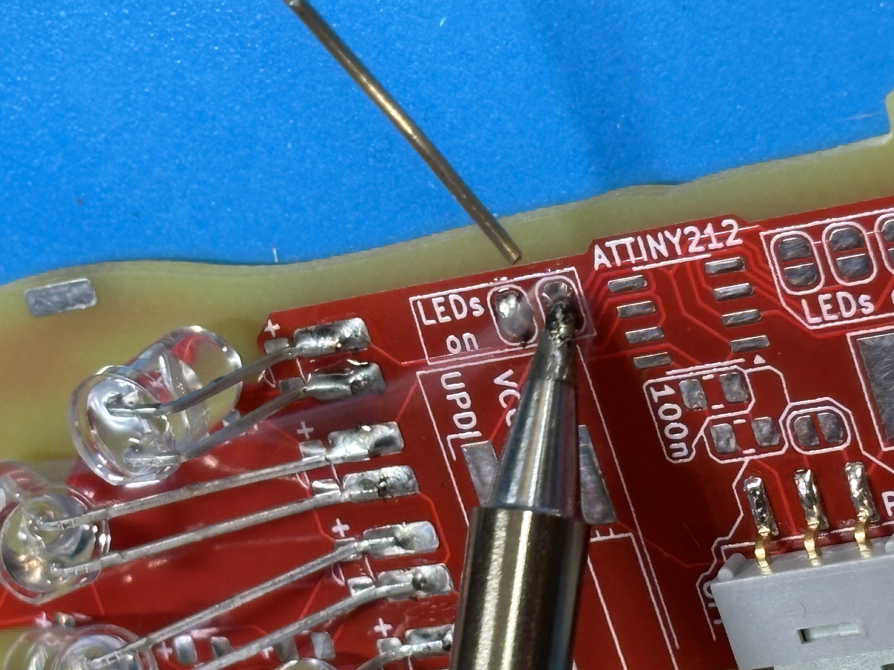

Als erstes Bauteil sollte bei dieser Variante der Schalter montiert werden.

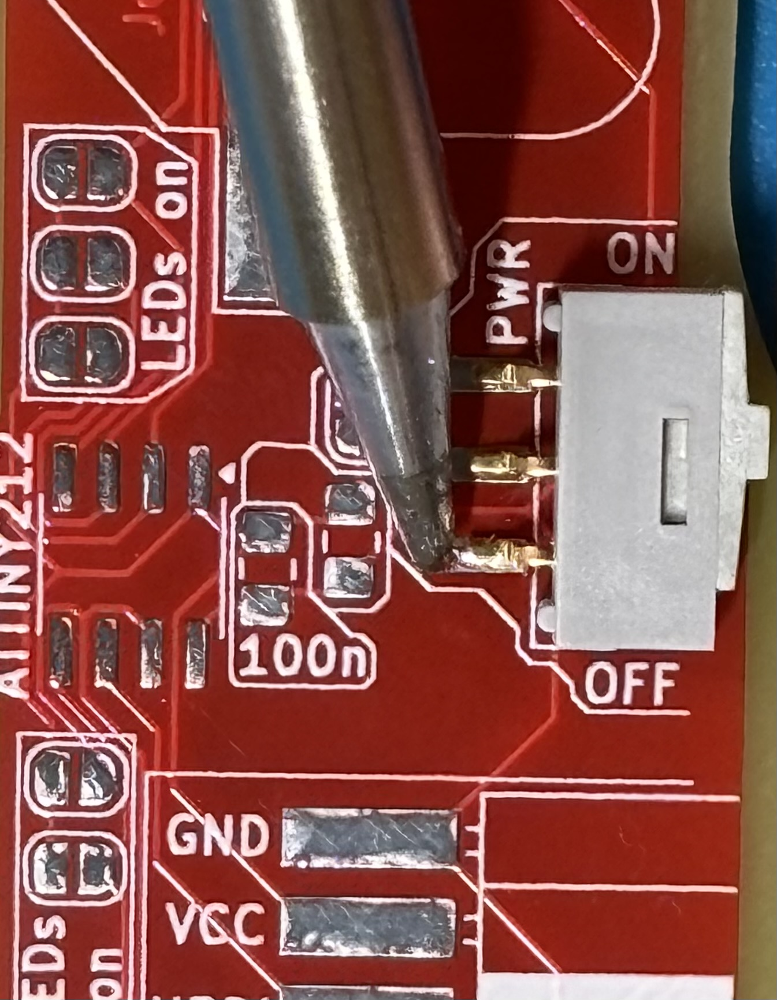

Damit die Knopfzelle guten Kontakt hat, sollte noch etwas Zinn auf den negativen Batteriekontakt auf der Platine gegeben werden. Aber auch nicht zu viel, sonst sitzt die Batterie nachher zu stramm.

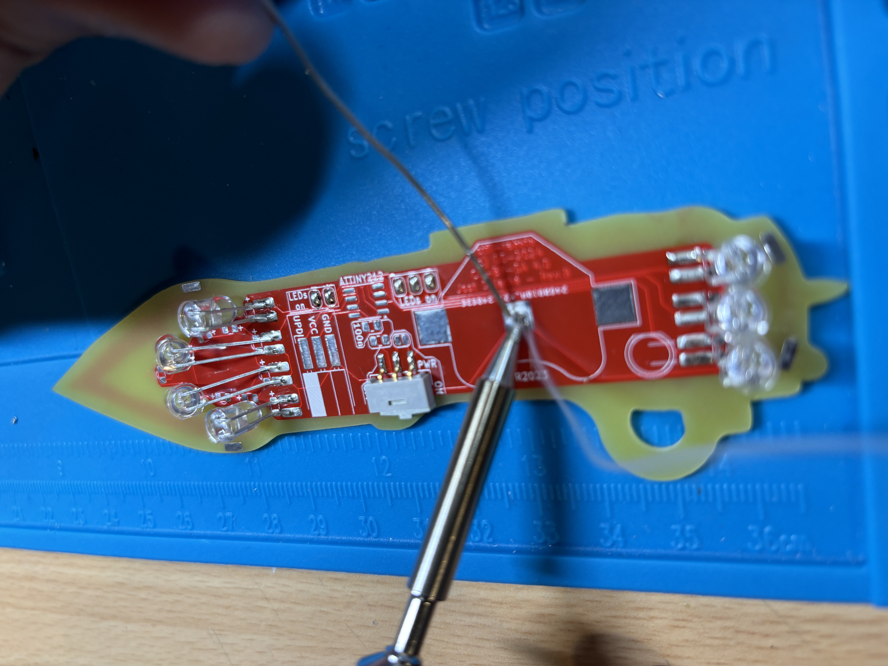

Danach kann der Batteriehalter dadrübergelötet werden. Hierbei am besten die beiden Verbindungen zwischen Lötpads und Batteriehalter richtig mit Zinn fluten, damit die mechanische Klemmkraft der Batterie den Halter später nicht abreißt.

Auf dem folgenden Bild sind die Stellen etwas zu sparsam ausgestattet:

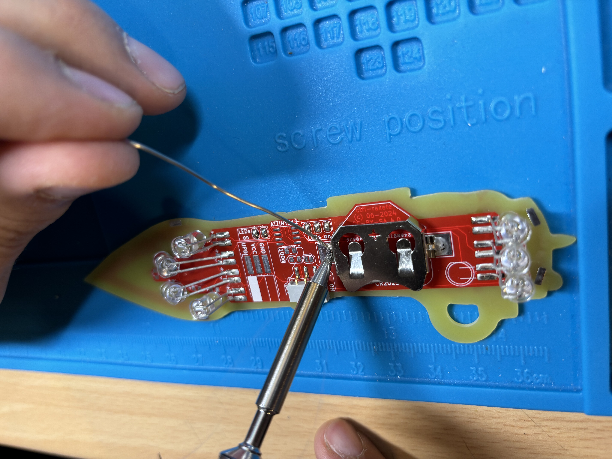

Jetzt gibt es Interpretationsspielraum, wie du die LEDs am liebsten montieren magst.

Hauptsache ist, dass du die beiden Beinchen richtig verbindest.

Das längere Beinchen ist Plus (auf der Platine mit "+" markiert), das kürzere Beinchen Minus. Aber selbst nachdem du die Beinchen gekürzt hast, kannst du das noch zuordnen, weil das Gehäuse der LED an der Minusseite etwas abgeflacht ist.

Wenn du eine LED falsch herum einbaust, leuchtet sie einfach nicht. Versuche dann, sie andersherum einzubauen.

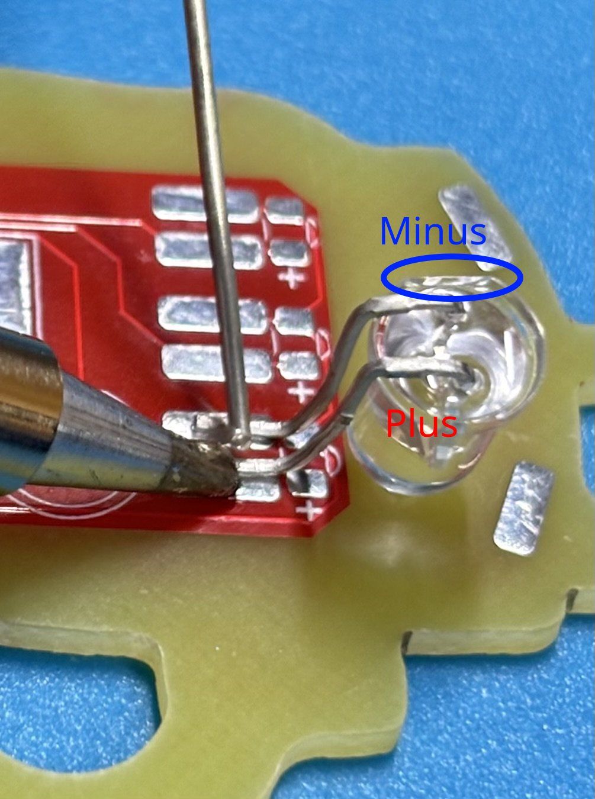

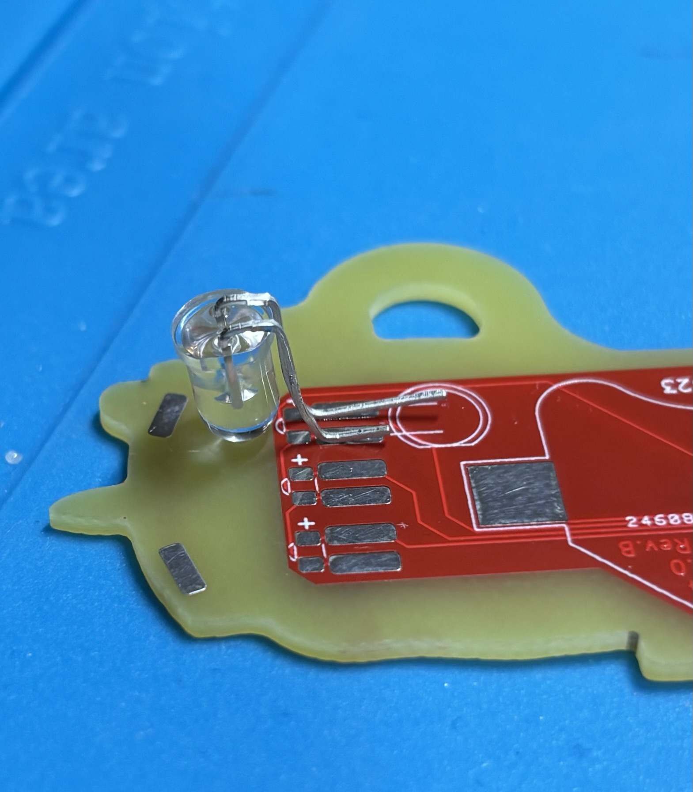

So könnten das dann zum Beispiel aussehen:

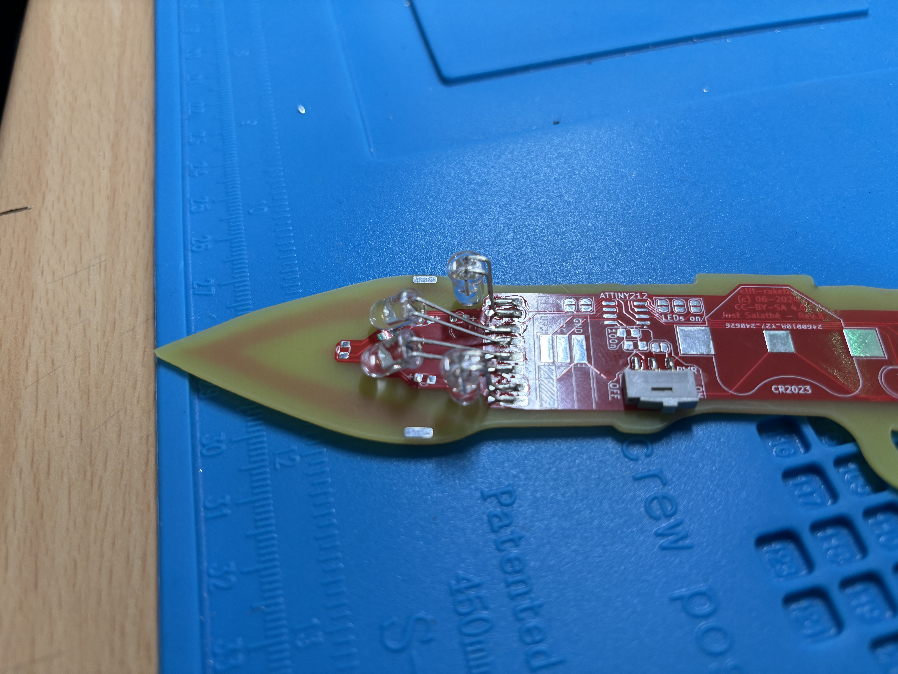

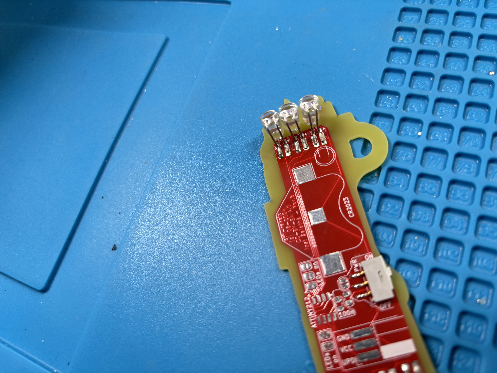

# Schwierigkeitsgrad 2: Mit Beinchen und Mircocontroller

## Benötigte Bauteile

In empfohlener Bestückreihenfolge sortiert:

| Nummer | Anzahl |Name |
| --- | --- | --- |
| 1 | 1 | Platine |
| 2 | 1 | Entkoppelkondensator 100 nF |
| 3 | 1 | Stützkondensator 1 uF |
| 1 | 1 | ATtiny212 Mircocontroller |
| 5 | 1 | Schalter |
| 6 | 1 | Programmieranschluss (UPDI) |
| 7 | 1 | Batteriehalter |
| 8 | 7 | weiße 5mm LED (ca. 3V)  |
| 9 | 1 | CR2032 Knopfzellenbatterie |

## Montagehinweise

Zur Montage des Schwierigkeitsgrads 1 ändert sich folgendes:
- Es wird zusätzlich ein Microcontroller mit ein paar Hilfsbauteilen aufgelötet
  - 2 SMD-Kondensatoren zur Stabilisierung der Controllerversorgung
  - Programmieranschluss
- Die 5 Lötbrücken werden nicht gesetzt - ihre Aufgabe wird von dem Microcontroller übernommen

Die Orientierung des Microcontrollers sollte unbedingt beachtet werden.
Auf dem Controllergehäuse ist ein Punkt bei Pin 1.
Passend dazu ist auf der Platine an Pin 1 ein kleiner Pfeil.

Die beiden Kondensatoren sind parallel geschaltet und dienen nur zur Stabilisierung der Versorgungsspannung des Microcontrollers.
Es ist nicht so wichtig, welcher von beiden wo sitzt.
Und falls einer oder beide verloren gehen, ist das auch nicht so schlimm.

# Schwierigkeitsgrad 3: Beinfrei

## Benötigte Bauteile

In empfohlener Bestückreihenfolge sortiert:

| Nummer | Anzahl |Name |
| --- | --- | --- |
| 1 |  1 | Platine |
| 2 |  1 | Entkoppelkondensator 100 nF |
| 3 |  1 | Stützkondensator 1 uF |
| 1 |  1 | ATtiny212 Mircocontroller |
| 5 |  1 | Schalter |
| 6 |  1 | Programmieranschluss (UPDI) |
| 7 | 14 | weiße 0402 LEDs (seitenleuchtend, ca. 3V)  |
| 8 |  1 | Batteriehalter |
| 9 |  1 | CR2032 Knopfzellenbatterie |

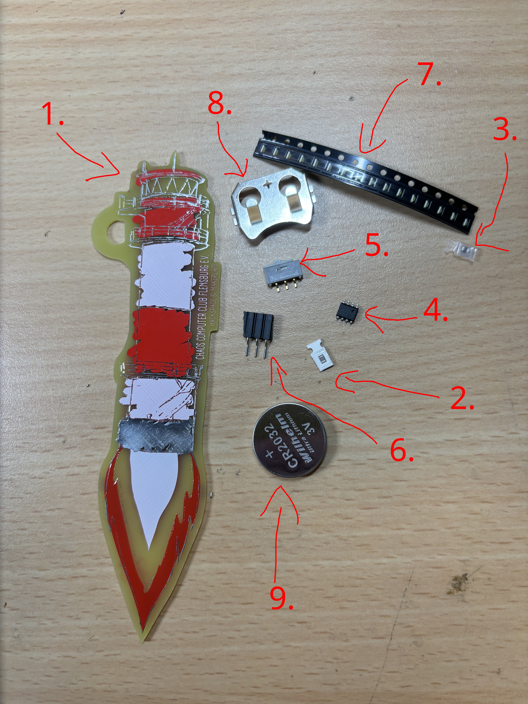

## Montagehinweise

Zur Montage des Schwierigkeitsgrads 2 ändert sich folgendes:
- die 7 5mm LEDs werden ersetzt durch 14 zur Seite leuchtende SMD-LEDs

Die Polarität der LEDs ist dabei unbedingt zu beachten:

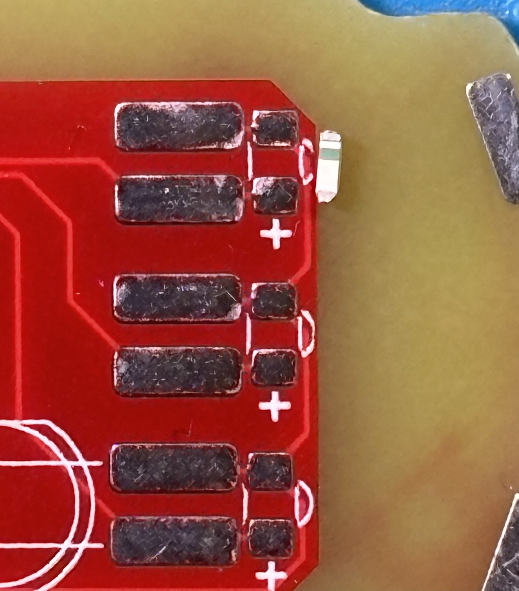

Verwende am besten eine Pinzette, um die LED in Position zu halten, während du die erste Seite festlötest:

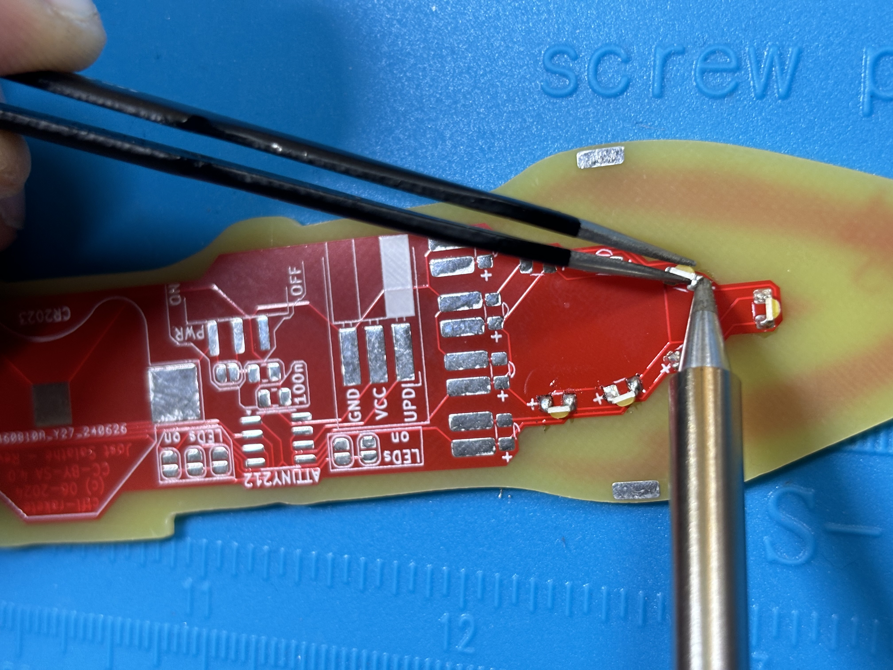

Es werden 14 LEDs benötigt.
Da die kleinen LEDs leicht einmal verloren gehen, legen wir den Kits normalerweise 16 LEDs bei.
